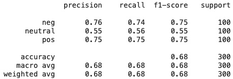
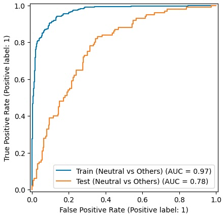
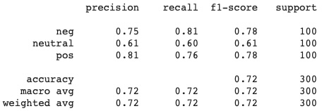
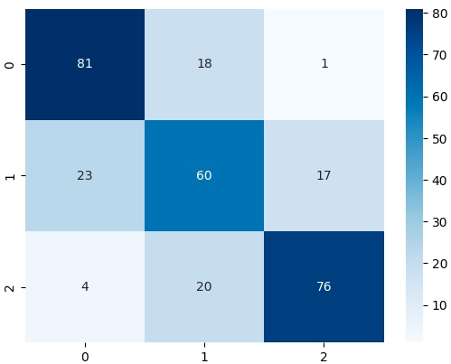
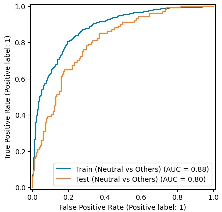

# Project Background
The objective of this project is to build a sentiment classifier to analyse guest feedback for a specific Airbnb property. Due to the large volume of data in the complete Singapore Airbnb dataset, this analysis focuses on Listing ID 42081657, a property with approximately 500 reviews.

## Data Sources
Two distinct datasets were used for this project: a target dataset for analysis and a labeled training dataset for model training.

1. Target Data (Airbnb Reviews)
    *  Source: [InsideAirbnb](https://insideairbnb.com/get-the-data/)
    * The initial dataset contains 38,350 reviews across 6 columns: ```listing_id```, ```id```, ```date```, ```reviewer_id```, ```reviewer_name```, and ```comments```.
    

2. Training Data (TripAdvisor Hotel Reviews)
    * Source: [TripAdvisor (via Kaggle)](https://www.kaggle.com/datasets/andrewmvd/trip-advisor-hotel-reviews) 
    * Contains 20,491 rows and 2 columns: ```Review``` and ```Rating```.
    

### Data Preparation
#### Airbnb Data
The primary focus of the cleaning process was the ```comments``` column, which contained dirty data:

* HTML tags such as ```<br/>```


* Non-English text: 


* Unnecessary columns (listing_id, id, date, etc.) were dropped.

* Nulls and Duplicates were removed.

After cleaning, the final dataset consisted of 372 unique reviews.

#### TripAdvisor Data
As the Airbnb dataset didn't contain sentiment labels, an external TripAdvisor Hotel Reviews dataset was used to train the classifier. The dataset contained a ```Rating``` column with values ranging from 1 to 5. To convert this into a supervised learning problem for sentiment analysis, the ratings were transformed into a categorical label with the following logic:

* Negative (0): Ratings of 1 and 2.
* Neutral (1): Rating of 3.
* Positive (2): Ratings of 4 and 5.

The training data was then processed using the same cleaning steps above and balanced by sampling 500 rows of each class.

.jpg)

# Modelling
## Feature Extraction with DistilBERT
This project employed Transfer Learning by leveraging a pre-trained DistilBERT model.
```
model_class, tokenizer_class, pretrained_weights = (ppb.DistilBertModel,
                                                    ppb.DistilBertTokenizer,
                                                    'distilbert-base-uncased')

tokenizer = tokenizer_class.from_pretrained(pretrained_weights)
model = model_class.from_pretrained(pretrained_weights)
```
Instead of fine-tuning the entire transformer architecture, the Feature Extraction approach was used:

* The review text was passed through the DistilBERT tokenizer and model.

* The hidden states from the last layer (specifically the [CLS] token representation) were extracted to serve as numerical features (embeddings) representing the semantic meaning of each review.

```
  # tokenization
  tokenized = tokenizer(text,
                        padding=True, # padding & masking
                        return_tensors='pt')

  # batching
  dataset = TensorDataset(tokenized['input_ids'],
                          tokenized['attention_mask'])
  dataloader = DataLoader(dataset, # batching for efficiency
                          batch_size=32,
                          shuffle=False)

  #embedding
  embeddings = []
  with torch.no_grad():
    for batch, batch_mask in dataloader:
      outputs = model(batch, attention_mask=batch_mask)
      batch_output = outputs[0][:, 0, :].numpy() # extraxt CLS token only
      embeddings.append(batch_output)

  x = np.concatenate(embeddings, axis=0)
```
## Classification with Logistic Regression
Once the DistilBERT features were extracted, they served as the input for a Logistic Regression classifier which performed the final multi-class classification task to categorize reviews into the 3 labels (Negative, Neutral, or Positive).


### Evaluation
The model was evaluated using a train-test split (80/20).
#### Initial Performance
The baseline model achieved an accuracy of ~68% and struggled with the "Neutral" class, misclassifying almost half of all neutral sentiments as negative/positive.




The ROC curve also showed that the model was overfitting with a high training AUC but a low validation AUC.



To resolve this, a Grid Search was performed with the following adjustments:

* Log-scale regularization (C): Switched from a linear scale to a log scale to explore stronger regularization values.

* L1 and L2 penalties: Both penalty types were included in the search. L1 encourages sparsity (zeroing out less important features), while L2 shrinks all weights uniformly. This gave the model more options to generalize.

* Macro-F1 scoring metric: The evaluation metric was changed from default accuracy to f1_macro, which equally weights performance across all three classes.

```
parameters = {
    'C': np.logspace(-10, 1, 10),
    'penalty': ['l1','l2']
    }

clf = LogisticRegression(multi_class='multinomial')

grid_search = GridSearchCV(clf, parameters, scoring='f1_macro')
grid_search.fit(x_train, y_train)
```
#### Tuned Performance
After tuning, the model improved slightly across all metrics, though it still struggles with the neutral class. This is likely due to the ambiguity in neutral reviews.




The tuned model also showed a smaller gap on the ROC curve between training and test sets.



# Analysis and Recommendations

The trained model was applied to the 372 cleaned reviews of Airbnb Listing 42081657. The predicted sentiment distribution is as follows:

|Sentiment|Count|Proportion|
|---|---|---|
|Positive | 239 | 64% |
|Neutral | 113 | 30% |
|Negative | 21 | 6% |

The overall guest perception is positive, though some operational friction points exist.

### Favorable Guest Satisfaction (64% Positive)

Guests frequently praise the location ("Easy to find") and the high level of service provided by the staff ("easy to talk to, and very professional"). This indicates that the property's personnel and geographic convenience are its strongest assets.

### High Volume of Neutral Sentiments (30%)


Neutral reviews frequently contain mixed sentiments (e.g., praising the location but mentioning a minor inconvenience) or purely factual statements without strong emotional vocabulary.

### Low Attrition Rate (6% Negative) with Specific Pain Points


Only 21 out of 372 reviews were flagged as negative. While this low volume is excellent, isolating these 21 reviews reveals recurring issues that disrupt the guest experience:

 * **External Noise:** Multiple guests complained about noise from adjacent construction sites ("noisy skyscraper construction all night", "construction site on both sides").

* **Internal Noise:** Some guests reported disruptive noises from the elevator ("elevator bangs and slams"). 

* **Bathroom**: A few reviews highlighted complains regarding bathroom maintenance (e.g., sliding doors not locking, poor drainage, sewer smells and no hot water).

## Recommendations for the Property Owner

**1. Manage Guest Expectations**

Update Listing Description: Since construction noise is a recurring external issue beyond the owner's control, proactively stating this in the Airbnb listing will manage guest expectations before they book.

Provide Comfort Amenities: To mitigate the construction and elevator noise, the owner could provide complimentary earplugs in every room.

**2.  Prioritize Targeted Maintenance**

Some reviews point to specific infrastructure issues (elevator noise, plumbing/sewer smells, broken AC, and faulty bathroom locks). The owner should identify which specific room numbers correlate with these complaints and temporarily block them from being booked until plumbing and soundproofing repairs are completed.

Improve Shower Facilities: Ensure hot water heaters are consistently serviced and that bathroom ventilation is improved to resolve the lingering odor issues mentioned.

**3. Elevate the "Neutral" Experience**

Enhance the Check-in Process: One review noted the check-in was "overly complicated." Streamlining this process (e.g., using a clear visual guide, a digital lockbox, or a pre-arrival WhatsApp message) will provide a good first impression.

Leverage Staff Strengths: Since the staff is frequently praised, empower them to add personalized touches (e.g., a handwritten welcome note or local dining recommendations). These low-cost, high-impact gestures are proven to convert "neutral" stays into positive reviews.

## AI Ethics

### Privacy and Data Anonymization

The project took steps to anonymize the data by dropping explicit personally identifiable columns, such as ```reviewer_id``` and ```reviewer_name```.

However, a residual privacy risk remains within the unstructured text column. Guests frequently include names of hosts or travel companions in their reviews (e.g., "Thank you Nigel"). While this dataset is public, deploying the model in a private enterprise would require additional processing steps, such as using Named Entity Recognition (NER) to mask names and sensitive details before the data is stored or processed.

### Fairness and Representation Bias

The data cleaning process intentionally filtered out non-English reviews to simplify the project, this decision introduces representation bias. By excluding non-English feedback, the model silences the voices of international guests from non-English-speaking regions.

Additionally, training the model on a general TripAdvisor dataset introduces a domain and cultural shift. The model may struggle to accurately evaluate Singlish or localized terms found in the Singaporean Airbnb reviews. A fair model would require a diverse, multilingual training dataset that accurately reflects the property's global guest demographic.

### Accuracy and Labeling Assumptions

The project relied on proxy labeling, assuming that a 3-star TripAdvisor rating equates to a "Neutral" sentiment. In reality, a 3-star review may contain highly polarized statements (e.g., "The location was amazing, but the room was filthy").

Because the model struggles most with this neutral class, there is a risk of misclassifying actionable negative feedback as neutral. If severe complaints—such as safety concerns or hygiene issues—are absorbed into the neutral category, the property owner might fail to address critical problems.

### Accountability

The property owners must be aware of the model's limitations (73% accuracy rate and 60% recall in neutral class) and accountable for how they interpret insights. High-stakes decisions, such as firing a cleaning vendor based on "negative" sentiment trends, should always involve human-in-the-loop verification.

### Transparency and Explainability

While the logistic regression classifier is highly interpretable, the DistilBERT embeddings is a "black box." It is difficult to explain exactly which words or phrases triggered a specific sentiment prediction. Future iterations of this project could incorporate explainable AI (XAI) tools to highlight the specific keywords driving the model's decisions.

## Source Codes and Datasets
Upload your model files and dataset into a GitHub repo and add the link here. 
